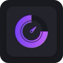
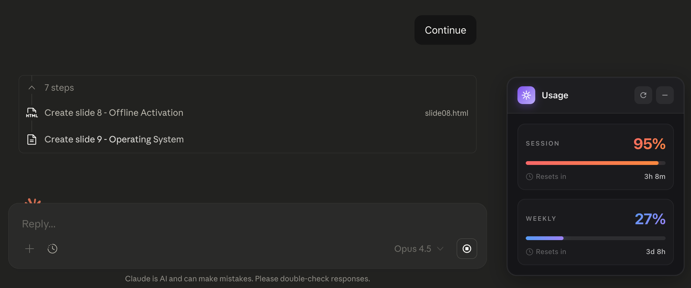

# Claude Usage Checker

<div align="center">
  
  
  **Track your Claude.ai usage with a beautiful floating popup**
</div>

---

## ✨ Features

- 📊 **Real-time Usage** - Displays actual usage from Claude's API
- ⏱️ **Session & Weekly Limits** - Shows 5-hour and 7-day quotas
- 🎨 **Dark Theme** - Clean, modern glassmorphism design
- 🔒 **Privacy Focused** - No data collection, all local
- 🔄 **Auto Refresh** - Updates every 60 seconds

## 📸 Screenshot

<div align="center">
  
</div>

## 🚀 Installation

1. Clone: `git clone https://github.com/0xAstroAlpha/Claude-Usage-Checker.git`
2. Go to `chrome://extensions/`
3. Enable **Developer mode**
4. Click **Load unpacked** → select the folder
5. Visit [claude.ai](https://claude.ai)

## 📁 Files

```
├── manifest.json       # Extension config
├── content.js          # Main script
├── tracker-styles.css  # Popup styling
├── icon128.png         # Icon
└── icon512.png         # Large icon
```

## 🔒 Privacy

- ✅ No external data collection
- ✅ No background scripts
- ✅ Only reads from Claude's API

---

<div align="center">
  Made by <b>Brian Le</b>
</div>
